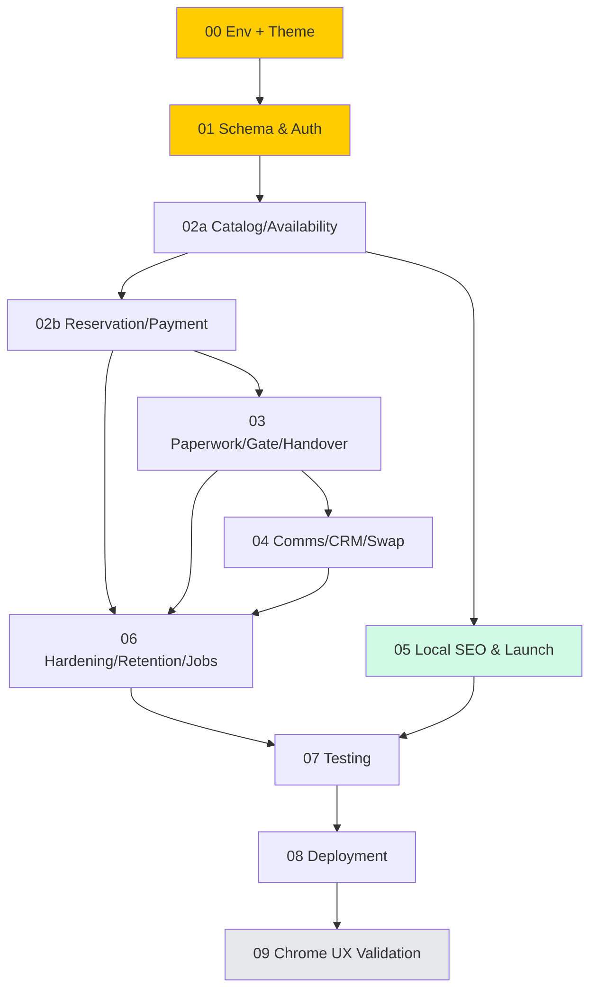

# BUILDPLAN: Eastern Rentals

**Spec Version:** v2.1 (LOCKED)
**SOW Reference:** eastern-rentals-sow.md (v1.3, signed)
**Generated:** June 6, 2026
**Target Stack:** Next.js + TypeScript (Tailwind + Google Fonts), FastAPI (Python), Supabase/PostgreSQL, Supabase Auth + Storage, Redis (locks/jobs)
**Deployment Target:** Docker on Hetzner VPS (same architecture as owner's other builds), Caddy/nginx TLS
**Operator:** Claude Code

---

## Build Sequence

**Critical path:** 00 → 01 → 02a → 02b → 03 → 04 → 06 → 07 → 08.
**Parallelizable:** **05 (Local SEO)** branches off 02a and can run in a second terminal alongside 02b/03/04 — it touches only town pages, sitemap, and the ELM import script (no shared files with the booking flow). Flag if 05 and 02a are ever edited concurrently (shared catalog data read only).

## Phase Summary

| Phase | Name | Complexity | Est. Turns | Prerequisites | SOW Features | Operator File | Status |
|-------|------|-----------|------------|---------------|-------------|---------------|--------|
| 00 | Environment & Theme Foundation | Low–Med | 25 | None | — | `eastern-rentals-phase-00-environment.md` | ⬜ |
| 01 | Schema & Auth Foundation | High | 75 | 00 | F-002, F-012, F-030(schema) | `eastern-rentals-phase-01-foundation.md` | ⬜ |
| 02a | Catalog, Inventory & Availability | High | 75 | 01 | F-001, F-002, F-003, F-004, F-005, F-026 | `eastern-rentals-phase-02a-catalog-availability.md` | ⬜ |
| 02b | Reservation, Quote & Booking-Fee Payment | Very High | 100 | 02a | F-006, F-007, F-009, F-010, F-011, F-019, F-028, F-030 | `eastern-rentals-phase-02b-reservation-payment.md` | ⬜ |
| 03 | Accounts, Paperwork, Release Gate & Handover | Very High | 100 | 02b | F-007b, F-008, F-012, F-013, F-014, F-015, F-016, F-017, F-018, F-027 | `eastern-rentals-phase-03-paperwork-handover.md` | ⬜ |
| 04 | Comms, CRM, Ops & Unit Swap | High | 75 | 03 | F-020, F-021, F-022, F-023, F-025, F-029 | `eastern-rentals-phase-04-comms-ops.md` | ⬜ |
| 05 | Local SEO & Launch | Medium | 50 | 02a | F-024 (+ ELM import, M-001) | `eastern-rentals-phase-05-seo-launch.md` | ⬜ |
| 06 | Hardening, Retention & Background Jobs | Med–High | 50 | 02b, 03, 04 | — (cross-cutting) | `eastern-rentals-phase-06-hardening.md` | ⬜ |
| 07 | Testing & Quality | High | 75 | all features | — (§9) | `eastern-rentals-phase-07-testing.md` | ⬜ |
| 08 | Deployment & Operations | Medium | 50 | 07 | — (§1.3) | `eastern-rentals-phase-08-deployment.md` | ⬜ |
| 09 | Visual/UX Validation (Claude in Chrome) | Human | — | 08 | — | `eastern-rentals-phase-09-chrome-validation.md` | ⬜ |

## Feature Traceability

Every SOW feature appears in exactly one **primary** build phase (schema groundwork in 01 noted where relevant).

| SOW Feature | Description | Build Phase | Spec Sections | Status |
|-------------|-------------|-------------|---------------|--------|
| F-001 | Equipment catalog | 02a | 3.2, 4.2, 4.5 | ⬜ |
| F-002 | Unit-level inventory model | 01 (schema) + 02a | 2.2, 2.5 | ⬜ |
| F-003 | Day-level availability calendar | 02a | 2.5, 3.2, 4.2/4.5 | ⬜ |
| F-004 | Availability conflict engine | 01 (constraint) + 02a | 2.5 | ⬜ |
| F-005 | Turnaround — next-day (no buffer) | 02a | 2.5 | ⬜ |
| F-006 | Advance reservation w/ date range | 02b | 3.2 | ⬜ |
| F-007 | Pay-to-reserve — booking fee | 02b | 0, 3.2, 5.1 | ⬜ |
| F-007b | Balance at pickup | 03 (handover) | 3.2, 5.1 | ⬜ |
| F-008 | Security deposit at handover (≤5d/>5d) | 03 | 3.2, 5.1 | ⬜ |
| F-009 | Delivery + distance pricing | 02b | 3.2, 5.5 | ⬜ |
| F-010 | Multi-day discount (disabled at launch) | 02b | 2.2, 3.2 | ⬜ |
| F-011 | Loyalty discount (manual tier) | 02b | 2.2, 3.2 | ⬜ |
| F-012 | Customer accounts | 01 (auth) + 03 (UI) | 7.1, 2.2 | ⬜ |
| F-013 | Driver's license upload | 03 | 2.2, 7.3 | ⬜ |
| F-014 | Manual license/renter review | 03 | 3.2, 8.3 | ⬜ |
| F-015 | Rental contract (e-sign) | 03 | 5.2, 3.3 | ⬜ |
| F-016 | Liability waiver (e-sign) | 03 | 5.2, 3.3 | ⬜ |
| F-017 | Paperwork-completion gate | 03 | 2.2, 3.2 | ⬜ |
| F-018 | "What's Next" page | 03 | 3.2, 4.2/4.5 | ⬜ |
| F-019 | Cancellation (non-refundable fee) | 02b | 0, 3.2 | ⬜ |
| F-020 | Condition photos at pickup/return | 04 | 2.2, 7.3 | ⬜ |
| F-021 | Transactional email | 04 | 5.3 | ⬜ |
| F-022 | Transactional SMS | 04 | 5.4, 2.2 | ⬜ |
| F-023 | Customer records + message log | 04 | 2.2 | ⬜ |
| F-024 | Per-town landing pages | 05 | 4.4 | ⬜ |
| F-025 | Admin dispatch view | 04 | 3.2, 4.2 | ⬜ |
| F-026 | Admin equipment/reservation mgmt | 02a + 03 (override) | 3.2 | ⬜ |
| F-027 | Deposit capture/release on return | 03 | 3.2, 5.1 | ⬜ |
| F-028 | Towing/pickup acknowledgment | 02b | 2.2, 3.2 | ⬜ |
| F-029 | Mid-rental unit swap | 04 | 5.2, 3.2 | ⬜ |
| F-030 | Dumpster category & 30%-down billing | 01 (schema) + 02b | 0, 2.2, 3.2 | ⬜ |

All 30 SOW features traced. (Carried review findings REV-xxx are addressed within the phases noted in the Risk Register.)

---

## Phase Details

### Phase 00: Environment & Theme Foundation
**Complexity:** Low–Med | **Est. Turns:** 25 | **Prerequisites:** None
**Operator:** `eastern-rentals-phase-00-environment.md` | **Review:** `eastern-rentals-review-phase-00.md`

**Objective:** A reproducible Dockerized monorepo (Next.js + FastAPI + Supabase + Redis) that boots clean, with the approved industrial theme (§4.5) wired into Tailwind and an app shell rendering the rotating-gear header.

**Components Built:** repo scaffold per §4.1; Docker Compose (app, api, redis; Supabase managed); Doppler secrets wiring; `.env.example`; Tailwind theme tokens + fonts + component layer + shell (§4.5); health endpoints.
**Acceptance:** `docker compose up` boots all services; Next.js renders the themed shell (gear spins, fonts/tokens load); FastAPI `/health` 200; Supabase reachable; no secrets in repo.
**Spec References:** 1.2, 1.3, 4.1, 4.4, 4.5. **Rollback:** delete project dir, re-scaffold. No persistent state.

### Phase 01: Schema & Auth Foundation
**Complexity:** High | **Est. Turns:** 75 | **Prerequisites:** 00
**Operator:** `eastern-rentals-phase-01-foundation.md` | **Review:** `eastern-rentals-review-phase-01.md`

**Objective:** Complete database schema, RLS, the availability exclusion constraint, config singleton, seed, and Supabase Auth with idempotent provisioning. After this phase the data model supports every feature and users can authenticate.
**Components Built:** all tables §2.2 incl. `admin_users`, `processed_webhook_events`, `legal_hold` columns; ENUM/CHECK (§2.2.1) + `updated_at` triggers; inclusive-`daterange` exclusion constraint (§2.5); RLS incl. **column-scoped `customers`** + `is_admin()` (§2.2/§7.2); `config` singleton + completeness healthcheck (§2.2); rental status ENUM + transition trigger + `recompute_gate()` (§2.2); seed §2.4; Auth + idempotent provisioning (§7.1).
**Acceptance:** all tables/columns/types/constraints match §2.2 exactly; FKs match §2.1 ERD; exclusion constraint blocks same-day rebook, allows next-day, ignores cancelled/expired; **a customer cannot UPDATE `license_status`/`loyalty_tier` via PostgREST**; config healthcheck fails on missing required key; seed loads (incl. dumpster category `percent_down`); register/login/refresh/logout work; admin gated by `admin_users`.
**Spec References:** 2 (all), 7 (all), 3.1. **Rollback:** drop tables, re-migrate (seed only).
**⚠ CRITICAL here — schema errors cascade.** REV-029 (RLS escalation), REV-001 (exclusion constraint), REV-006 (state machine), REV-008 (config), REV-021 (provisioning), V3-004 (`admin_users`).

### Phase 02a: Catalog, Inventory & Availability
**Complexity:** High | **Est. Turns:** 75 | **Prerequisites:** 01
**Objective:** Public catalog + detail + day-level availability calendar, and admin inventory CRUD, all on the industrial theme.
**Components:** catalog/detail pages (F-001), calendar (F-003), availability engine w/ insert-retry concurrency (F-004/REV-003), next-day semantics (F-005), admin product/unit/rate CRUD (F-026).
**Acceptance:** catalog shows active only; calendar reflects reservations + next-day; concurrent-request test — only one wins the last unit, other free units still bookable; admin CRUD works. **Spec:** 2.5, 3.2, 4.2, 4.5. **Rollback:** git revert to phase tag.

### Phase 02b: Reservation, Quote & Booking-Fee Payment
**Complexity:** Very High | **Est. Turns:** 100 | **Prerequisites:** 02a
**Objective:** A renter can quote (authoritative server pricing), reserve a unit, and pay the non-refundable booking fee to confirm; delivery priced; cancellation non-refundable.
**Components:** quote engine (F-007 money formula + **clamp + dumpster `percent_down`**), reservation create + unit lock (F-006), Stripe booking-fee intent + cents util, delivery (F-009), discount/loyalty schema-wired but disabled (F-010/11), towing ack (F-028), non-refundable cancel (F-019), rate limit + Radar (H-003).
**Acceptance:** quote matches §3.2 formula incl. `booking_fee ≤ total` and dumpster mode; failed fee doesn't hard-release; success → `reserved`; delivery rejects >40 mi; 3.5% on card only. **Spec:** 0, 3.2, 5.1, 5.5, 2.5. **Rollback:** git revert; void test PIs.
**⚠ CRITICAL/HIGH:** **V3-001** booking-fee clamp + dumpster carve-out; **REV-009** money; **REV-011** server price authority; **REV-030** cents; **REV-003/V3-006** hold shield.

### Phase 03: Accounts, Paperwork, Release Gate & Handover
**Complexity:** Very High | **Est. Turns:** 100 | **Prerequisites:** 02b
**Objective:** Accounts, license upload + review, contract + waiver e-sign, the release gate, the "What's Next" page, and the handover transaction (balance + deposit) with safe ordering.
**Components:** account UI (F-012), license upload + admin review + notify (F-013/14/M-005), SignWell contract + waiver post-payment + idempotent webhook + polling + override (F-015/16/H-004), release gate + state machine (F-017), What's Next (F-018), **handover (F-007b balance + F-008 deposit ≤5d/>5d, ordered deposit→balance→active, V3-003)**, deposit settlement (F-027).
**Acceptance:** handover blocked until gate satisfied; deposit-first ordering with compensation; webhook idempotent + completed-after-override safe; license self-approval impossible. **Spec:** 2.2, 3.2, 3.3, 5.1, 5.2, 7.1, 7.3. **Rollback:** git revert; disable SignWell via flag.
**⚠ HIGH:** **V3-003** handover atomicity; **REV-004** webhook idempotency; **REV-006** gate/state.

### Phase 04: Comms, CRM, Ops & Unit Swap
**Complexity:** High | **Est. Turns:** 75 | **Prerequisites:** 03
**Objective:** Transactional email/SMS with consent + idempotency, the message log + customer records, the admin dispatch view, condition photos, and mid-rental unit swap.
**Components:** email (F-021/§5.3), SMS + consent (F-022/§5.4), message log + CRM (F-023), dispatch (F-025), condition photos + Storage RLS (F-020/REV-031), unit swap Option B (F-029/REV-015).
**Acceptance:** notifications idempotent (no dup on job re-run); consent respected; swap re-checks target availability + e-sign addendum; photos admin-only. **Spec:** 5.3, 5.4, 2.2, 7.3, 5.2. **Rollback:** git revert; feature-flag comms.

### Phase 05: Local SEO & Launch
**Complexity:** Medium | **Est. Turns:** 50 | **Prerequisites:** 02a (parallelizable with 02b/03/04)
**Objective:** Indexable per-town landing pages and the consented ELM import.
**Components:** SSG/ISR town pages w/ unique copy + LocalBusiness schema (F-024), sitemap/robots/canonical, ELM import w/ opt-in/unsubscribe + fresh A2P (M-001).
**Acceptance:** unique indexable page per town, no near-duplicates; sitemap submitted; import respects consent. **Spec:** 4.4. **Rollback:** unpublish pages; import is additive + reversible.

### Phase 06: Hardening, Retention & Background Jobs
**Complexity:** Med–High | **Est. Turns:** 50 | **Prerequisites:** 02b, 03, 04
**Objective:** Cross-cutting hardening, the retention/purge jobs honoring legal-hold, and worker reliability.
**Components:** rate limiting/headers/validation; error taxonomy (§8.1); **retention purge honoring `legal_hold` incl. customer-scoped `license_uploads` (V3-002)** + Storage-object-before-row deletion (REV-013/31); worker retry/backoff/DLQ + dashboards (REV-023); notification idempotency guard (REV-020); license AV/re-encode (REV-022).
**Acceptance:** purge skips held records (incl. license images under customer hold); jobs retry + dead-letter; rate limits enforced. **Spec:** 8.1, 8.3, 7.3, 7.4. **Rollback:** git revert; jobs are idempotent/disable-able.
**⚠ HIGH:** **V3-002** license legal-hold.

### Phase 07: Testing & Quality
**Complexity:** High | **Est. Turns:** 75 | **Prerequisites:** all features
**Objective:** Playwright E2E for critical journeys + unit tests for money/auth/data-integrity.
**Components:** E2E (§9.3 — browse→reserve→booking-fee, handover, license/e-sign/gate); unit (§9.2 — money/clamp/dumpster, ≤5/>5, **RLS escalation**, webhook idempotency, inclusive-range overlap, cents); seed (§9.5); CI scripts; viewport matrix.
**Acceptance:** all E2E pass across configured browsers/viewports; unit coverage meets §9 targets; no shared-mutable-state tests. **Spec:** 9 (all). **Rollback:** n/a (tests).

### Phase 08: Deployment & Operations
**Complexity:** Medium | **Est. Turns:** 50 | **Prerequisites:** 07
**Objective:** Production deploy on Hetzner with TLS, DR, monitoring, smoke tests.
**Components:** prod Docker + Caddy/nginx TLS; DR/backups + RTO (§1.3); health checks; monitoring/alerting; smoke tests.
**Acceptance:** prod boots; TLS valid; health green; backup + restore rehearsed; smoke tests pass. **Spec:** 1.3, 8.3. **Rollback:** revert to previous image.

### Phase 09: Visual/UX Validation (Claude in Chrome) — Human, Optional
Human-driven validation of the §4.5 theme + WCAG-AA at 375/768/1440 on key journeys, post-deploy to staging. Not an automated build phase.

---

## Execution Guidance — Claude Code Orchestration

**Per phase:** paste the operator prompt as one block → `claude --max-turns [N]` (per table) → if turn-limited, `claude --continue` (prompt handles resumption via `PHASE-NN-PROGRESS.md`) → on completion, paste the **review prompt into a SEPARATE session** → act on PROMOTE/FIX/ESCALATE.

**Session isolation:** fresh session per phase; never continue Phase N into Phase N+1 — the completion report carries context, not the session.

**Parallelism:** after 02a, run 05 in a second terminal alongside 02b/03/04.

**Session strategy:** Low 25 · Medium 50 · High 75 · Very High 100 turns.

**Human gates (non-negotiable):** after 00 (structure), after **01 (schema/RLS — errors cascade)**, after **02b (money/payment)**, after **03 (gate/handover)**, before 08 (deploy), and any ESCALATE.

---

## Risk Register (carried from review cycles)

| Risk | Phase | Mitigation in build |
|------|-------|---------------------|
| Customer self-approves license / self-grants loyalty (REV-029, was CRITICAL) | 01 | Column-scoped `customers` UPDATE + protected-column trigger; unit test asserts the attack fails |
| Double-booking / buffer (REV-001, was CRITICAL) | 01/02a | Inclusive `daterange` exclusion constraint; concurrency test |
| Concurrency spurious-409 / hold race (REV-003) | 02a/02b | Insert-retry; payment-in-flight shield via `payment_attempted_at`; webhook re-verify |
| Booking fee > total → overcharge (V3-001, CRITICAL) | 02b | Clamp `≤ total` + dumpster `percent_down`; unit-test matrix |
| Money base/rounding (REV-009), Stripe cents (REV-030) | 02b | Pinned formula + `round_half_up`; integer-cents Decimal util |
| Handover partial failure (V3-003) | 03 | Deposit→balance→active ordering + compensation + idempotency keys; E2E for partial-failure |
| Webhook duplicate/late (REV-004) | 03 | `processed_webhook_events` insert-first; completed-after-override safe |
| Identity PII purged under hold (V3-002) | 06 | Customer-scoped `legal_hold`; license purge honors it |
| Deposit < machine value | — | Accepted residual (SOW §11); condition photos + v2 damage waiver |
| Single-VPS outage (REV-014) | 08 | DR/backups/RTO documented; not re-architected (owner decision) |

## Rollback Strategy

| Phase | Rollback | Data Impact |
|-------|----------|-------------|
| 00 | Delete project, re-scaffold | None |
| 01 | Drop tables, re-migrate | Seed only |
| 02a–04 | Git revert to phase tag; void test Stripe PIs | Preserve user data — migrations reversible |
| 05 | Unpublish pages; import additive/reversible | None |
| 06 | Git revert; jobs idempotent/disable-able | None |
| 07 | n/a | None |
| 08 | Revert to previous Docker image | Zero downtime if blue-green |
