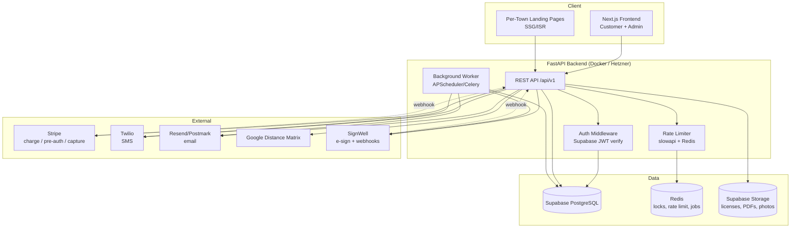
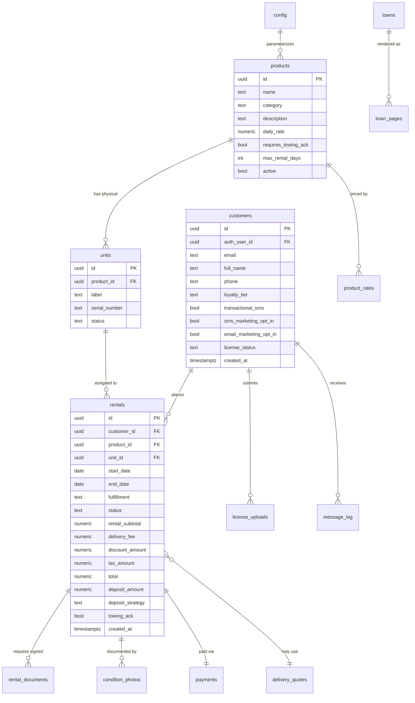

# Master Architecture Specification: Eastern Rentals

**Version:** 2.1
**SOW Reference:** eastern-rentals-sow.md (**v1.3, LOCKED & signed** — reconciled to the booking-fee/handover model)
**Date:** June 6, 2026
**Status:** **LOCKED** — Cycle-3 fixes + booking-fee policy applied; SOW v1.3 issued and signed. Ready for `build-prompter`.
**Review provenance:** Three adversarial cycles (Claude Opus 4.8, GPT-5.5, Grok, Gemini) → synthesis → owner decisions. See changelog.

-----

## 0. Changelog

### v2 → v2.1 (Cycle-3 verification fixes + approved UI theme)

Cycle-3 verified v2 closed ~30 of 34 prior findings cleanly; the items below address what it surfaced.

- **V3-001 (CRITICAL — booking fee could exceed total).** Resolved two ways by category (`products.booking_fee_mode`): **`standard`** (equipment) keeps the clamped formula `booking_fee = min(round(0.30 × first_day_rate + 100 × (rental_days − 1), 2), grand_total)` — the clamp is a safety rail so a non-refundable fee can never exceed the rental; **`percent_down`** (**dumpsters**, their own category) is simply `round(0.30 × rental_subtotal, 2)` — 30% down, no per-day component (inherently ≤ total). `balance_amount = max(0, grand_total − booking_fee)` in both. *Dumpsters' fuller billing flow (disposal/tonnage/overage, and whether they carry a card-hold security deposit) is a deferred separate flow — "for now" only the 30%-down booking fee differs.*
- **V3-002 (HIGH — legal hold didn't protect identity PII).** `legal_hold`/`hold_*` columns added to **`customers`** (not just `rentals`); the license-purge job now skips any `license_uploads` whose owning customer is under hold (§2.2, §7.3).
- **V3-003 (HIGH — handover atomicity).** `/handover` now has defined ordering + compensation: place/verify deposit FIRST, then settle balance, then the `→ active` flip is the last single committed DB write; any external failure leaves status un-flipped and is resumable/idempotent (§3.2).
- **V3-004 (MEDIUM — `admin_users` undefined).** The `admin_users` table referenced by §3.1/§7 is now defined in §2.2 + ERD + seed, with an `is_admin()` helper backing RLS (§7.2).
- **REV-007 finish (MEDIUM).** CHECK constraints added to all remaining controlled-value text fields; `updated_at` + trigger added to `license_uploads`, `rental_documents`, `units` (§2.2.1).
- **V3-006 (LOW — payment-in-flight signal).** `rentals.payment_attempted_at` added; the hold-TTL job excludes rentals with a recent value (§2.5).
- **Approved industrial UI theme** captured as a design system (§4.5) — fonts, color tokens, components, hazard motifs, and the rotating gear. Prototype mock numbers are **not** authoritative; the §3.2 money rules govern.

**LOCKED.** Booking-fee policy resolved (dumpster carve-out) and SOW v1.3 issued + signed (REV-028/V3-005 closed). No open items; proceed to build planning.

### v1 → v2

Each change cites the consolidated finding (REV-xxx) and/or owner decision it implements, and the SOW objective it serves.

**Payment model redesign (owner decision; rewrites F-007/F-008/F-019).** v1 charged the full total + deposit at reservation. v2 splits payment across three moments:
- **At booking:** a **non-refundable booking fee** = `round(0.30 × first_day_rate + 100 × (rental_days − 1), 2)` *(clamped ≤ grand_total in v2.1 — see v2→v2.1 above)*, charged to card with a **3.5% service fee** (surcharge is the cost of card payment; cash/other carry none; surcharge does **not** credit toward the total). The fee **credits** toward the tax-inclusive grand total. *(Serves O-001, O-006.)*
- **At pickup/handover:** the **balance** (`grand_total − booking_fee`) is settled by card (+3.5%), cash, or other.
- **Deposit at handover** (not booking): **hold ≤5 days / charge >5 days**, refunded/released on clean return; extensions handled manually. *(Serves O-003.)*

**REV-002 (CRITICAL) — resolved by design.** Placing the deposit hold at handover removes the advance-booking pre-auth-expiry problem; the ≤5-day boundary leaves an inspection margin inside Stripe's ~7-day auth window.

**REV-001 (CRITICAL) — resolved without timestamptz.** Owner confirmed **no turnaround buffer; daily rentals; unit available the next calendar day.** `date` columns are retained; an **inclusive-bound** `daterange` exclusion constraint enforces "available next day" natively. `products.buffer_hours` removed; F-005 redefined. *(Serves O-004.)*

**REV-029 (CRITICAL, new in cycle 2) — column-level RLS.** `customers` UPDATE restricted to safe columns; `license_status`/`loyalty_tier` protected by trigger so a customer cannot self-approve or self-upgrade. *(Serves O-002, O-006.)*

**HIGH/MEDIUM applied:** REV-003 (reservation concurrency: exclusion-first + insert-retry + payment-in-flight shield + webhook re-verify), REV-004/REV-032 (Stripe **and** SignWell webhook idempotency + `charge.refunded` handler), REV-005 (`legal_hold` columns + retention honoring them), REV-006 (formal rental status ENUM + transition guard + gate recompute on every source mutation), REV-007 (ENUM/CHECK on controlled-value fields + `updated_at` triggers), REV-008 (`config` NOT NULL + singleton + completeness healthcheck), REV-009 (authoritative money formula + rounding), REV-010 (empty/error/outage states; delivery-quote-failure reserves on fee), REV-013/REV-031 (Supabase **Storage** RLS + 300s signed-URL TTL + object deletion on purge), REV-015 (unit swap → single-field e-sign addendum + target-availability re-check), REV-016 (component-level a11y criteria), REV-020/REV-023 (notification idempotency + worker retry/DLQ/alerting), REV-030 (Stripe integer-cents conversion utility), REV-021 (idempotent customer provisioning).

**Deferred (owner decision):** REV-014 (single VPS — DR documented, not re-architected), REV-024/REV-025 (extra fraud/checkout-recovery), deposit-overage charge (accepted SOW residual risk).

**§14 owner values baked in:** sales tax 8.75%; max rental 30 days; delivery $199 ≤10 mi + $5/mi beyond, **40 mi** max radius; turnaround buffer none; yard hours Mon–Fri 07:00–17:00, Sat 07:00–15:00, Sun closed; retention license 12 mo / contracts+waivers 6 yr / condition photos 6 yr (pending attorney confirmation); multi-day discount **none at launch**; deposit = uniform **30%** of pre-tax subtotal (single `deposit_percent` = 0.30000).

-----

## 1. System Architecture Overview

### 1.1 Architecture Diagram



### 1.2 Technology Stack

|Layer           |Technology                          |Version  |Rationale                                                                                 |
|----------------|------------------------------------|---------|------------------------------------------------------------------------------------------|
|Frontend        |Next.js (App Router) + TypeScript   |14+      |Owner standard; SSG/ISR for SEO town pages; React Server Components keep customer UX light|
|Styling         |Tailwind CSS + Google Fonts (next/font)|3+   |frontend-design skill; approved industrial theme (§4.5): Black Ops One/Teko/Saira/Share Tech Mono + ind-* tokens|
|Backend         |FastAPI (Python)                    |0.110+   |Owner standard; async, Pydantic validation, clean OpenAPI                                 |
|Database        |Supabase / PostgreSQL               |PG 15+   |Owner standard; RLS, Auth, Storage in one                                                 |
|Cache/Locks/Jobs|Redis                               |7+       |Advisory-lock backup, rate limiting (slowapi), job queue                                  |
|Auth            |Supabase Auth                       |current  |Email/password, JWT; RLS integration                                                      |
|Storage         |Supabase Storage                    |current  |License images, signed PDFs, condition photos; private buckets                            |
|Background jobs |APScheduler (MVP) → Celery if needed|-        |SignWell polling, reminders, hold expiry checks                                           |
|Payments        |Stripe                              |API 2024+|Charge + pre-auth + capture/refund; Radar for fraud                                       |
|SMS             |Twilio                              |current  |Reuse existing A2P 10DLC numbers                                                          |
|Email           |Resend or Postmark                  |current  |Transactional only; marketing kept separate                                               |
|Distance        |Google Distance Matrix API          |current  |Delivery pricing (reuse ELM pattern)                                                      |
|E-sign          |SignWell                            |current  |Contract + waiver; reuse Maningo pattern                                                  |
|Hosting         |Docker Compose on Hetzner VPS       |-        |Owner standard                                                                            |

### 1.3 Deployment Topology

Single Hetzner VPS running Docker Compose: (1) `web` — Next.js, (2) `api` — FastAPI/uvicorn behind nginx/Caddy reverse proxy with TLS, (3) `worker` — background scheduler, (4) `redis`. PostgreSQL, Auth, and Storage are managed by Supabase (cloud). Secrets via Doppler (owner standard) injected as env vars. CI/CD via GitHub Actions: lint → test → build images → deploy over SSH. Environments: local (port 3007 per owner convention), staging, production. nginx/Caddy terminates TLS and routes `/api/*` → FastAPI, everything else → Next.js.

**Disaster recovery (REV-014, documented not re-architected):** the single VPS is an accepted owner constraint at this scale. Supabase provides managed Postgres backups (daily; point-in-time on paid tiers — confirm tier). Document and rehearse: DB restore procedure, weekly off-site backup export of the Supabase project + Storage buckets to independent storage, and a target RTO (suggest ≤4 hrs). Redis holds only ephemeral locks/jobs and needs no backup. Revisit redundant infrastructure when transaction volume warrants.

-----

## 2. Database Schema

### 2.1 Entity Relationship Diagram



### 2.2 Table Definitions

> **2.2.1 Controlled-value constraints & timestamps (REV-007).** All controlled-value fields use a Postgres ENUM or a `CHECK (... IN (...))` constraint — not free text. Beyond `rental_status` and `deposit_state`, this covers: `units.status` (available/maintenance/retired), `customers.license_status` (none/pending/approved/rejected), `customers.loyalty_tier` (none/bronze/silver/gold), `license_uploads.status` (pending/approved/rejected), `rental_documents.status` (pending/sent/completed/manual_override), `rental_documents.doc_type` (contract/waiver), `rentals.fulfillment` (pickup/delivery), `rentals.balance_paid_method` (card/cash/other), `rentals.deposit_strategy` (hold/charge), `condition_photos.phase` (pickup/return), `message_log.channel` (email/sms), `message_log.status` (sent/failed/delivered). Every mutable table carries `updated_at timestamptz NOT NULL DEFAULT now()` maintained by a shared `BEFORE UPDATE` trigger — explicitly including `license_uploads`, `rental_documents`, and `units` (which lacked it in v2).


#### `customers`

**Implements:** F-012, F-011, F-013, F-022, F-023

|Column                |Type       |Constraints          |Default          |Description                              |
|----------------------|-----------|---------------------|-----------------|-----------------------------------------|
|id                    |uuid       |PK                   |gen_random_uuid()|Primary key                              |
|auth_user_id          |uuid       |FK→auth.users, UNIQUE|-                |Supabase Auth link                       |
|email                 |text       |NOT NULL, UNIQUE     |-                |Contact email                            |
|full_name             |text       |NOT NULL             |-                |Renter name                              |
|phone                 |text       |                     |-                |E.164 phone                              |
|loyalty_tier          |text       |NOT NULL             |‘none’           |none/bronze/silver/gold (manual, F-011)  |
|transactional_sms     |bool       |NOT NULL             |true             |Transactional SMS consent (F-022)        |
|sms_marketing_opt_in  |bool       |NOT NULL             |false            |Marketing SMS consent (F-022)            |
|email_marketing_opt_in|bool       |NOT NULL             |false            |Marketing email consent                  |
|license_status        |text       |NOT NULL             |‘none’           |none/pending/approved/rejected (F-013/14)|
|legal_hold            |bool       |NOT NULL             |false            |Blocks PII purge incl. license_uploads (V3-002, §7.3)|
|hold_reason           |text       |                     |-                |Legal-hold reason                        |
|hold_set_by           |uuid       |                     |-                |Admin who set hold                       |
|hold_set_at           |timestamptz|                     |-                |                                         |
|created_at            |timestamptz|NOT NULL             |now()            |                                         |
|updated_at            |timestamptz|NOT NULL             |now()            |                                         |

**Indexes:** `idx_customers_auth_user_id` on `auth_user_id`; `idx_customers_email` on `email`; `idx_customers_license_status` on `license_status` (admin review queue).
**RLS (REV-029 — privilege-escalation fix):** customer SELECT own row; customer UPDATE restricted to **safe columns only** — `full_name`, `phone`, `transactional_sms`, `sms_marketing_opt_in`, `email_marketing_opt_in`. `license_status` and `loyalty_tier` are **admin-only**, enforced by `GRANT UPDATE (<safe cols>)` to `authenticated` plus a `BEFORE UPDATE` trigger that rejects non-admin changes to protected columns. Without this, a customer hitting PostgREST directly could self-approve their license (defeating F-014/O-002) or self-grant a loyalty discount (O-006). Admin role full access.

#### `products`

**Implements:** F-001, F-002, F-028, M-002

|Column             |Type         |Constraints|Default          |Description                 |
|-------------------|-------------|-----------|-----------------|----------------------------|
|id                 |uuid         |PK         |gen_random_uuid()|                            |
|name               |text         |NOT NULL   |-                |e.g., “Skid Steer”          |
|category           |text         |NOT NULL   |-                |Grouping/filter             |
|description        |text         |           |-                |Specs/copy                  |
|photo_url          |text         |           |-                |Primary image               |
|daily_rate         |numeric(10,2)|NOT NULL   |-                |Base daily rate (= first_day_rate for booking fee)|
|booking_fee_mode   |text         |NOT NULL, CHECK in ('standard','percent_down')|‘standard’|Booking-fee formula (V3-001): `standard` = equipment; `percent_down` = dumpsters (30% of subtotal, no per-day)|
|requires_towing_ack|bool         |NOT NULL   |false            |Towable (F-028, L-002)      |
|max_rental_days    |int          |NOT NULL   |30               |Max span (M-002)            |
|active             |bool         |NOT NULL   |true             |Hidden if false (F-001); cannot be set true until `config.deposit_percent` is set|
|created_at         |timestamptz  |NOT NULL   |now()            |                            |
|updated_at         |timestamptz  |NOT NULL   |now()            |                            |

> Turnaround buffer removed (F-005 → none; see §2.5). Deposit is a **uniform percent** of the pre-tax rental subtotal via `config.deposit_percent` (owner decision), not a per-product field; the resolved dollar amount is snapshotted onto `rentals.deposit_amount` at handover.

**Indexes:** `idx_products_active` on `active`; `idx_products_category` on `category`.
**RLS:** public SELECT where `active = true`; admin full access.

#### `units`

**Implements:** F-002, F-004, F-029

|Column       |Type       |Constraints          |Default          |Description                     |
|-------------|-----------|---------------------|-----------------|--------------------------------|
|id           |uuid       |PK                   |gen_random_uuid()|                                |
|product_id   |uuid       |FK→products, NOT NULL|-                |Parent product                  |
|label        |text       |NOT NULL             |-                |e.g., “Skid Steer #2”           |
|serial_number|text       |                     |-                |Asset serial (named in contract)|
|status       |text       |NOT NULL             |‘available’      |available/maintenance/retired   |
|created_at   |timestamptz|NOT NULL             |now()            |                                |

**Indexes:** `idx_units_product_id` on `product_id`; `idx_units_status` on `status`.
**RLS:** admin only (availability exposed via API, not direct unit reads).

#### `product_rates`

**Implements:** F-010 (multi-day discount, L-003)

|Column    |Type         |Constraints          |Default          |Description                  |
|----------|-------------|---------------------|-----------------|-----------------------------|
|id        |uuid         |PK                   |gen_random_uuid()|                             |
|product_id|uuid         |FK→products, NOT NULL|-                |                             |
|min_days  |int          |NOT NULL             |-                |Threshold (inclusive)        |
|rate_type |text         |NOT NULL             |‘percent_off’    |percent_off/flat_daily/weekly|
|value     |numeric(10,2)|NOT NULL             |-                |Discount % or rate           |

**Indexes:** `idx_product_rates_product_id` on `product_id`.
Tiered table supports flat %, per-day override, or weekly rate (resolves L-003).

#### `rentals`

**Implements:** F-006, F-007, F-008, F-009, F-010, F-011, F-017, F-019, F-027, F-028, F-029

|Column          |Type         |Constraints           |Default          |Description                     |
|----------------|-------------|----------------------|-----------------|--------------------------------|
|id              |uuid         |PK                    |gen_random_uuid()|                                |
|customer_id     |uuid         |FK→customers, NOT NULL|-                |                                |
|product_id      |uuid         |FK→products, NOT NULL |-                |                                |
|unit_id         |uuid         |FK→units              |-                |Assigned unit (swappable, F-029)|
|start_date      |date         |NOT NULL              |-                |                                |
|end_date        |date         |NOT NULL              |-                |                                |
|fulfillment     |text         |NOT NULL              |‘pickup’         |pickup/delivery (F-009)         |
|delivery_address|text         |                      |-                |If delivery                     |
|status          |rental_status|NOT NULL              |‘pending_fee’    |ENUM; see status section below  |
|rental_subtotal |numeric(10,2)|NOT NULL              |-                |Pre-discount/tax                |
|discount_amount |numeric(10,2)|NOT NULL              |0                |Multi-day + loyalty (0 at launch)|
|delivery_fee    |numeric(10,2)|NOT NULL              |0                |(F-009)                         |
|tax_amount      |numeric(10,2)|NOT NULL              |0                |8.75% on (subtotal−discount+delivery)|
|total           |numeric(10,2)|NOT NULL              |-                |Tax-inclusive grand total       |
|booking_fee_amount|numeric(10,2)|NOT NULL            |-                |Non-refundable; credits toward total (F-007)|
|booking_fee_paid_at|timestamptz |                     |-                |Reservation confirmed (gate `paid`)|
|payment_attempted_at|timestamptz|                     |-                |Set when booking-fee PI created/confirmed; shields from hold-TTL expiry (V3-006); cleared on webhook|
|balance_amount  |numeric(10,2)|NOT NULL              |0                |total − booking_fee; due at pickup|
|balance_paid_method|text       |                      |-                |card/cash/other (ENUM)          |
|balance_paid_at |timestamptz  |                      |-                |Settled at handover             |
|service_fee_total|numeric(10,2)|NOT NULL             |0                |Sum of 3.5% card surcharges (not part of total)|
|deposit_amount  |numeric(10,2)|NOT NULL              |0                |Snapshot = deposit_percent × subtotal, set at handover (F-008)|
|deposit_strategy|text         |                      |-                |hold/charge (≤5d vs >5d), set at handover (F-008)|
|towing_ack      |bool         |NOT NULL              |false            |(F-028)                         |
|license_ok      |bool         |NOT NULL              |false            |Gate condition (F-017)          |
|contract_signed |bool         |NOT NULL              |false            |Gate condition (F-017)          |
|waiver_signed   |bool         |NOT NULL              |false            |Gate condition (F-017)          |
|paid            |bool         |NOT NULL              |false            |Gate condition: booking fee paid (F-017)|
|legal_hold      |bool         |NOT NULL              |false            |Blocks retention purge (REV-005, §13)|
|hold_reason     |text         |                      |-                |Legal-hold reason               |
|hold_set_by     |uuid         |                      |-                |Admin who set hold              |
|hold_set_at     |timestamptz  |                      |-                |                                |
|released_at     |timestamptz  |                      |-                |When equipment handed over      |
|returned_at     |timestamptz  |                      |-                |When returned                   |
|created_at      |timestamptz  |NOT NULL              |now()            |                                |
|updated_at      |timestamptz  |NOT NULL              |now()            |Maintained by trigger (REV-007) |

**Status ENUM (`rental_status`, REV-007):** `pending_fee` → `reserved` → `ready_for_pickup` → `active` → `returned` → `closed`; plus `cancelled`, `expired` (reachable from pre-`active` states only). Transitions enforced by a `BEFORE UPDATE` trigger (REV-006); illegal jumps rejected.
**Release/handover gate (F-017):** handover (transition `ready_for_pickup → active`) is permitted only when `paid AND license_ok AND contract_signed AND waiver_signed`. `paid` = booking fee captured at reservation. Balance settlement and deposit placement are part of the handover transaction itself (admin/POS), which the gate guards — they are not pre-handover booleans. Gate enforced in the service layer **and** a DB CHECK on the `→ active` transition. `recompute_gate(rental_id)` is called from every mutation that affects a source (license decision, document webhook/override, refund) so denormalized flags can't drift (REV-006).
**Indexes:** `idx_rentals_unit_dates` on `(unit_id, start_date, end_date)`; `idx_rentals_status` on `status`; `idx_rentals_customer_id` on `customer_id`; `idx_rentals_dates` on `(start_date, end_date)` (dispatch); `idx_rentals_legal_hold` on `legal_hold` WHERE `legal_hold` (retention).
**Exclusion constraint (F-004, REV-001):** generated inclusive range + GiST exclude with status predicate (see §2.5). No buffer column; "available next day" is enforced by inclusive bounds.
**RLS:** customer SELECT own rentals; admin full access.

#### `payments`

**Implements:** F-007, F-008, F-027

|Column                  |Type         |Constraints         |Default          |Description                                 |
|------------------------|-------------|--------------------|-----------------|--------------------------------------------|
|id                      |uuid         |PK                  |gen_random_uuid()|                                            |
|rental_id               |uuid         |FK→rentals, NOT NULL|-                |                                            |
|stripe_booking_fee_intent_id|text     |                    |-                |Booking-fee charge PI (reservation)         |
|stripe_balance_intent_id|text         |                    |-                |Balance charge PI (if paid by card at pickup)|
|stripe_deposit_intent_id|text         |                    |-                |Deposit hold/charge PI (at handover)        |
|booking_fee_charged     |numeric(10,2)|NOT NULL            |0                |Booking fee actually captured               |
|balance_charged         |numeric(10,2)|                    |-                |Balance captured (card path only)           |
|deposit_state           |text         |NOT NULL            |‘none’           |ENUM: none/held/charged/captured/released/refunded|
|deposit_captured_amount |numeric(10,2)|                    |-                |Partial/full capture (F-027)                |
|deposit_refund_amount   |numeric(10,2)|                    |-                |Deposit released/refunded on return         |
|created_at              |timestamptz  |NOT NULL            |now()            |                                            |
|updated_at              |timestamptz  |NOT NULL            |now()            |Trigger-maintained (REV-007)                |

**Indexes:** `idx_payments_rental_id` on `rental_id`; unique on `stripe_booking_fee_intent_id`.
**RLS:** admin only; customer sees summarized state via rental endpoint.

#### `processed_webhook_events`

**Implements:** REV-004 (webhook idempotency for Stripe + SignWell)

|Column     |Type       |Constraints|Default|Description                          |
|-----------|-----------|-----------|-------|-------------------------------------|
|provider   |text       |NOT NULL   |-      |stripe/signwell                      |
|event_id   |text       |NOT NULL   |-      |Provider event id                    |
|received_at|timestamptz|NOT NULL   |now()  |                                     |

**Primary key:** `(provider, event_id)`. Every webhook handler inserts here first inside the transaction; a duplicate key short-circuits processing (return 200, no side effects). **RLS:** admin/service only.

#### `license_uploads`

**Implements:** F-013, F-014, §13

|Column       |Type       |Constraints           |Default          |Description              |
|-------------|-----------|----------------------|-----------------|-------------------------|
|id           |uuid       |PK                    |gen_random_uuid()|                         |
|customer_id  |uuid       |FK→customers, NOT NULL|-                |                         |
|storage_path |text       |NOT NULL              |-                |Private bucket path      |
|status       |text       |NOT NULL              |‘pending’        |pending/approved/rejected|
|reviewed_by  |uuid       |                      |-                |Admin                    |
|reviewed_at  |timestamptz|                      |-                |                         |
|reject_reason|text       |                      |-                |                         |
|purge_after  |date       |                      |-                |Retention (§13)          |
|created_at   |timestamptz|NOT NULL              |now()            |                         |

**Indexes:** `idx_license_status` on `status` (review queue); `idx_license_purge` on `purge_after` (retention job).
**RLS:** customer SELECT own; admin full.

#### `rental_documents`

**Implements:** F-015, F-016, F-017, H-004

|Column              |Type       |Constraints         |Default          |Description                           |
|--------------------|-----------|--------------------|-----------------|--------------------------------------|
|id                  |uuid       |PK                  |gen_random_uuid()|                                      |
|rental_id           |uuid       |FK→rentals, NOT NULL|-                |                                      |
|doc_type            |text       |NOT NULL            |-                |contract/waiver                       |
|signwell_document_id|text       |                    |-                |SignWell ref                          |
|status              |text       |NOT NULL            |‘pending’        |pending/sent/completed/manual_override|
|signed_pdf_path     |text       |                    |-                |Stored signed PDF                     |
|override_by         |uuid       |                    |-                |Admin (F-026 override)                |
|last_polled_at      |timestamptz|                    |-                |Polling fallback (H-004)              |
|created_at          |timestamptz|NOT NULL            |now()            |                                      |

**Indexes:** `idx_docs_rental_id` on `rental_id`; `idx_docs_status` on `status`.
**RLS:** customer SELECT own; admin full.

#### `condition_photos`

**Implements:** F-020, M-004

|Column      |Type       |Constraints         |Default          |Description   |
|------------|-----------|--------------------|-----------------|--------------|
|id          |uuid       |PK                  |gen_random_uuid()|              |
|rental_id   |uuid       |FK→rentals, NOT NULL|-                |              |
|phase       |text       |NOT NULL            |-                |pickup/return |
|storage_path|text       |NOT NULL            |-                |Private bucket|
|taken_at    |timestamptz|NOT NULL            |now()            |              |
|uploaded_by |uuid       |NOT NULL            |-                |Admin         |

**Indexes:** `idx_photos_rental_id` on `rental_id`.
**RLS:** admin only (M-004 — admin-only visibility).

#### `delivery_quotes`

**Implements:** F-009, M-006

|Column        |Type         |Constraints|Default          |Description              |
|--------------|-------------|-----------|-----------------|-------------------------|
|id            |uuid         |PK         |gen_random_uuid()|                         |
|rental_id     |uuid         |FK→rentals |-                |Null until attached      |
|address       |text         |NOT NULL   |-                |                         |
|distance_miles|numeric(6,2) |NOT NULL   |-                |From yard                |
|quoted_fee    |numeric(10,2)|NOT NULL   |-                |After min/cap rules      |
|in_radius     |bool         |NOT NULL   |-                |Within max radius (M-006)|
|created_at    |timestamptz  |NOT NULL   |now()            |                         |

#### `message_log`

**Implements:** F-021, F-022, F-023

|Column     |Type       |Constraints           |Default          |Description          |
|-----------|-----------|----------------------|-----------------|---------------------|
|id         |uuid       |PK                    |gen_random_uuid()|                     |
|customer_id|uuid       |FK→customers, NOT NULL|-                |                     |
|rental_id  |uuid       |FK→rentals            |-                |                     |
|channel    |text       |NOT NULL              |-                |email/sms            |
|template   |text       |NOT NULL              |-                |Event key            |
|status     |text       |NOT NULL              |-                |sent/failed/delivered|
|provider_id|text       |                      |-                |Twilio/Resend id     |
|created_at |timestamptz|NOT NULL              |now()            |                     |

**Indexes:** `idx_msg_customer_id` on `customer_id`; `idx_msg_rental_id` on `rental_id`.

#### `towns` / `town_pages`

**Implements:** F-024, M-003, L-001

`towns`: id, name, slug (unique), distance_from_yard_miles, lat, lng, intro_copy, active.
`town_pages` (or derived at build): slug, title, meta_description, schema_json, hero_copy — guarantees per-page differentiation (M-003).

#### `config`

**Implements:** §14 owner-defined params, F-007, F-005, F-008, M-006

**Singleton table (REV-008):** `id boolean PRIMARY KEY DEFAULT true CHECK (id)` guarantees exactly one row. All columns `NOT NULL` with fail-closed defaults. A startup/health "config completeness" assertion blocks production boot if any required value is null or zero where zero is invalid.

|Key                       |Type         |Value (v2)                         |
|--------------------------|-------------|-----------------------------------|
|sales_tax_rate            |numeric(6,5) |0.08750 (Suffolk County, NY)       |
|card_service_fee_pct      |numeric(6,5) |0.03500 (card payments only)       |
|deposit_percent           |numeric(6,5) |0.30000 (30% of pre-tax rental subtotal; uniform across categories)|
|booking_fee_first_day_pct |numeric(6,5) |0.30000                            |
|booking_fee_per_extra_day |numeric(10,2)|100.00                             |
|delivery_base_fee         |numeric(10,2)|199.00 (covers first 10 mi)        |
|delivery_free_miles       |int          |10                                 |
|delivery_per_mile         |numeric(10,2)|5.00 (beyond free miles)           |
|delivery_max_radius_miles |int          |40                                 |
|max_rental_days_default   |int          |30                                 |
|deposit_hold_max_days     |int          |5 (≤ = hold, > = charge)           |
|yard_hours_json           |jsonb        |Mon–Fri 07:00–17:00, Sat 07:00–15:00, Sun closed|
|license_retention_months  |int          |12                                 |
|contract_retention_years  |int          |6                                  |
|photo_retention_years     |int          |6                                  |
|reservation_hold_ttl_min  |int          |15                                 |

> Removed from v1: `cancellation_window_hours`, `cancellation_refund_pct` (booking fee is non-refundable — F-019), `loyalty_discounts_json` and multi-day discount config are **disabled at launch** (no discount; `product_rates` remains in schema for later). Multi-day discount and loyalty re-enable by populating `product_rates`/loyalty config later — no migration needed.

#### `audit_log`

**Implements:** F-026 override audit, C-002 ops, §13

id, actor_id, action, entity_type, entity_id, detail_json, created_at. Captures admin overrides, deposit captures, unit swaps, deletions, and admin grant/revoke.

#### `admin_users`

**Implements:** REV-013 / V3-004 (server-side admin authority)

|Column     |Type       |Constraints          |Default          |Description                         |
|-----------|-----------|---------------------|-----------------|------------------------------------|
|id         |uuid       |PK                   |gen_random_uuid()|                                    |
|auth_user_id|uuid      |FK→auth.users, UNIQUE, NOT NULL|-      |Supabase Auth link                  |
|role       |text       |NOT NULL, CHECK in ('admin')|‘admin’   |Reserved for future role tiers      |
|granted_by |uuid       |                     |-                |Admin who granted                   |
|granted_at |timestamptz|NOT NULL             |now()            |                                    |
|revoked_at |timestamptz|                     |-                |Null = active                       |

**Source of truth for admin authorization (§3.1, §7.2).** An `is_admin()` SECURITY DEFINER function checks `EXISTS (SELECT 1 FROM admin_users WHERE auth_user_id = auth.uid() AND revoked_at IS NULL)`; every `admin role full access` RLS policy and every `/admin/*` route uses it. Grant/revoke writes `audit_log`. **RLS:** admin/service only. Seeded with the initial owner account (§2.4).

### 2.3 Migrations Strategy

Supabase migrations (versioned SQL in `supabase/migrations/`). Each migration is forward-only with a documented manual rollback note. Applied via CI on deploy. Local dev uses `supabase db reset` against seed.

### 2.4 Seed Data

Admin user (seeded into `admin_users` with the owner's `auth_user_id`, `role='admin'`); `config` single row seeded with all §14 values from §2.2 (`deposit_percent` = 0.30000); the completeness healthcheck passes; product categories (incl. **Dumpsters** as a distinct category with `booking_fee_mode='percent_down'`); initial fleet (3 skid steer units, 1 chipper, 1 mixer, trailer(s), dumpsters — dumpsters `percent_down`, all others `standard`) with units; town list (Center Moriches, Mastic, Mastic Beach, East Moriches, Manorville, Eastport, Shirley, Moriches).

### 2.5 Double-Booking Prevention (C-002 / F-004)

**Primary mechanism (REV-001):** a generated inclusive range column plus a `btree_gist` exclusion constraint is the source of truth.

```sql
CREATE EXTENSION IF NOT EXISTS btree_gist;
ALTER TABLE rentals
  ADD COLUMN occupied daterange
  GENERATED ALWAYS AS (daterange(start_date, end_date, '[]')) STORED;   -- inclusive both ends
ALTER TABLE rentals
  ADD CONSTRAINT no_unit_overlap
  EXCLUDE USING gist (unit_id WITH =, occupied WITH &&)
  WHERE (status NOT IN ('cancelled','expired'));
```

Inclusive bounds make `[Jun1,Jun3]` and `[Jun4,Jun6]` non-overlapping (a unit returned Jun3 is bookable Jun4 — "available next day") while a request starting Jun3 collides with `[Jun1,Jun3]` (no same-day rebook). This *is* the turnaround rule; there is no buffer column and no need for `timestamptz` under the daily-rental model. (If hourly or same-day turnaround is ever required, migrate `start_date`/`end_date` to `timestamptz` and the range to `tstzrange`.)

**Concurrency (REV-003):** the reservation handler picks a free unit and attempts the INSERT; on an exclusion/unique violation it catches the error and retries with the next free unit, returning `409 UNIT_UNAVAILABLE` only when no unit succeeds (prevents spurious rejection when other units are free). A reservation `hold` TTL (`config.reservation_hold_ttl_min`, default 15 min) expires `pending_fee` rentals via a background job to free squatted units — but a rental whose booking-fee payment is **in flight** is shielded from expiry — concretely, the TTL job excludes any `pending_fee` rental with a `payment_attempted_at` within the last (TTL + grace) minutes (set when the PaymentIntent is created/confirmed, cleared by the succeeded/failed webhook, V3-006) — and a transient `payment_failed` does **not** hard-release the unit (REV-033); the TTL governs so the customer can retry a card. The `payment_intent.succeeded` handler re-verifies the unit is still held before confirming; if it was freed, it attempts re-acquire via the insert-retry path and otherwise auto-refunds the booking fee and notifies. Validated by a concurrent-request test (§9).

-----

## 3. API Design

### 3.1 API Conventions

- Base URL: `/api/v1`
- Auth: Supabase JWT in `Authorization: Bearer <token>`. Admin authorization is **not** JWT-claim-only (REV-013): a server-side `admin_users` table is the source of truth, re-checked on every `/admin/*` request; the JWT `role=admin` claim is set from it and revocation takes effect immediately on the next request. Admin grant/revoke is itself audit-logged.
- Content-Type: `application/json`
- Error format: `{ "error": { "code": "string", "message": "string", "details": {} } }`
- Pagination: cursor-based (`?cursor=&limit=`) on list endpoints.
- Rate limiting (H-003): slowapi + Redis. Public: 60 req/min/IP. Checkout/payment: 10 req/min/IP and 5 failed-payment attempts/hour/account → 429. Availability quote: 30 req/min/IP. Reservation-hold creation throttled per account/IP to block hold-squatting.
- Validation: Pydantic models server-side; Zod mirrors on client.

### 3.2 Endpoint Definitions

#### Catalog & Availability — Implements F-001, F-002, F-003, F-004

- `GET /api/v1/products` (public) — list active products with rate, photo, category.
- `GET /api/v1/products/{id}` (public) — product detail + specs + deposit + towing flag.
- `GET /api/v1/products/{id}/availability?start=&end=` (public) — `{ available: bool, units_free: int }` for the span; a unit is free from the day after its prior rental's `end_date` (next-day model, no buffer).
- `GET /api/v1/products/{id}/calendar?month=` (public) — day-level availability map for the calendar UI.

##### `POST /api/v1/quote`

**Purpose:** Price a prospective rental (subtotal, multi-day discount, loyalty, delivery, tax, deposit) before checkout. **Auth:** Optional.
**Request:**

```json
{
  "product_id": "uuid",
  "start_date": "2026-07-01",
  "end_date": "2026-07-05",
  "fulfillment": "delivery",
  "delivery_address": "string (if delivery)"
}
```

**Response (200):** server is authoritative — it recomputes all amounts; any client-supplied figures are ignored (REV-011).

```json
{
  "rental_subtotal": "number",
  "discount_amount": "number (0 at launch)",
  "delivery_fee": "number",
  "delivery_in_radius": true,
  "tax_amount": "number (8.75% of subtotal−discount+delivery)",
  "total": "number (tax-inclusive grand total)",
  "booking_fee_amount": "number — standard: min(round(0.30×first_day_rate + 100×(days−1),2), total); percent_down (dumpsters): round(0.30×subtotal,2); non-refundable; credits to total",
  "balance_due": "number = max(0, total − booking_fee)",
  "card_service_fee_pct": 0.035,
  "deposit_amount": "number (deposit_percent × subtotal)",
  "deposit_strategy": "hold|charge (≤5d hold / >5d charge; placed at handover)",
  "requires_towing_ack": false,
  "available": true
}
```

**Rounding:** all money `round_half_up` to 2 decimals; deposit and the card service fee are **not** taxed; the booking fee is a payment against the tax-inclusive total, not a separate taxable line.

**Errors:** `400` invalid dates/over max_rental_days (M-002); `409` not available; `422` delivery outside radius (M-006).

#### Reservations — Implements F-006, F-007, F-019, F-028

##### `POST /api/v1/reservations`

**Purpose:** Create a held reservation (status `pending_fee`), lock a unit via the insert-retry path (§2.5), and return a Stripe client secret for the **booking fee only**. Server recomputes all amounts (REV-011). **Auth:** Required.
**Request:** product_id, dates, fulfillment, delivery_address (if delivery), `towing_ack` (required true if `requires_towing_ack` and pickup). No client-supplied prices are trusted.
**Response (201):** `{ "rental_id": "uuid", "booking_fee_amount": "number", "card_service_fee": "number", "booking_fee_client_secret": "string", "hold_expires_at": "timestamp" }`
**On `payment_intent.succeeded` (booking fee):** status → `reserved`, `paid = true`, `booking_fee_paid_at` set; documents sent (F-015/16). Deposit and balance are NOT taken here — they happen at handover.
**Errors:** `409 UNIT_UNAVAILABLE` (no free unit after retry, C-002); `422` towing_ack required; `429` hold throttle (H-003).

- `POST /api/v1/reservations/{id}/cancel` (auth) — releases the unit. **Booking fee is non-refundable** (F-019); no other money has been collected pre-pickup, so nothing else to refund. Writes `audit_log`.
- `GET /api/v1/reservations/{id}` (auth) — status + "What's Next" checklist (F-018), showing booking-fee-paid, license, contract, waiver, and balance-due-at-pickup.

#### Delivery — Implements F-009, M-006

- `POST /api/v1/delivery/quote` (public) — `{address}` → Google Distance Matrix → `{distance_miles, fee, in_radius}` applying min fee, per-mile, cap, max radius from `config`.

#### Account & Documents — Implements F-012, F-013, F-014, F-015, F-016, F-018

- `POST /api/v1/license` (auth) — upload license image → Storage; set `license_status=pending`; notify admin (F-014 / M-005).
- `GET /api/v1/me/rentals` (auth) — customer rental + document history.
- `POST /api/v1/rentals/{id}/documents/send` (system, post-payment) — create SignWell contract + waiver; meter (only post-payment).
- `GET /api/v1/rentals/{id}/documents` (auth) — signing links + status.

#### Admin — Implements F-014, F-020, F-025, F-026, F-027, F-029

- `GET /api/v1/admin/licenses?status=pending` — review queue.
- `POST /api/v1/admin/licenses/{id}/decision` — approve/reject (+reason); updates `customers.license_status`; re-evaluates affected rentals’ gate.
- `GET /api/v1/admin/dispatch?date=` — today’s pickups, returns, deliveries (F-025).
- `POST /api/v1/admin/rentals/{id}/photos` — upload condition photos (F-020).
- `POST /api/v1/admin/rentals/{id}/handover` — the pickup transaction (requires gate satisfied, F-017). **Ordered for safe partial failure (V3-003)** since Postgres, Stripe, and physical cash cannot share one atomic transaction: **(1) place/verify the deposit first** — pre-auth **hold** if `rental_days ≤ 5`, else **charge** (`>5`) — snapshotting `deposit_amount = deposit_percent × subtotal` and persisting the deposit PI id; if it fails, **no money has moved**, return a resumable error, stay `ready_for_pickup`. **(2) settle the balance** — `card` (Stripe, +3.5% surcharge, idempotency key), `cash`, or `other` (record `balance_paid_method`); if a card balance fails, **release the deposit hold** and return a resumable error. **(3)** the `ready_for_pickup → active` flip is the **last, single committed DB write**, made only after (1) and (2) succeed. All Stripe calls use the existing/created PI as the idempotency key so retries don't double-charge. Amounts converted to integer cents (REV-030). Replaces v1's `/release`.
- `POST /api/v1/admin/rentals/{id}/return` — mark returned; open deposit settlement.
- `POST /api/v1/admin/rentals/{id}/deposit` — capture (full/partial) or release/refund the deposit (F-027); writes `deposit_refund_amount`/`deposit_captured_amount` + `audit_log`.
- `POST /api/v1/admin/rentals/{id}/swap-unit` — reassign unit on an active rental; **re-checks the target unit is free for the remaining range** (exclusion constraint), generates a single-field SignWell e-sign addendum acknowledging the substitute serial (REV-015, Option B), preserves original contract/waiver, writes before/after serials to `audit_log` (F-029).
- `POST /api/v1/admin/documents/{id}/override` — manual mark-signed if webhook drops (F-026); writes `audit_log`.
- `POST /api/v1/admin/products|units|rates` CRUD (F-026).
- `POST /api/v1/admin/customers/{id}/delete` — execute retention-aware deletion (§13).

### 3.3 Webhook Handlers

- `POST /api/v1/webhooks/stripe` — verify signature; **idempotency-guard via `processed_webhook_events` first**. Handles: `payment_intent.succeeded` (booking-fee PI → status `reserved`, `paid=true`, re-verify unit still held per §2.5, fire document send); `payment_intent.payment_failed` (do **not** hard-release — let the hold TTL govern so the card can be retried, REV-033); deposit intent events; **`charge.refunded`** (sync `deposit_refund_amount` so admin/dashboard refunds reconcile, REV-032).
- `POST /api/v1/webhooks/signwell` — verify signature; **idempotency-guard via `processed_webhook_events`**. On `document.completed` set `contract_signed`/`waiver_signed`, store the signed PDF, call `recompute_gate`. **Completed-after-override:** if status is already `manual_override`, store the real signed PDF and append `audit_log` but do not regress gate flags or re-fire side effects. Backed by polling fallback (H-004): worker polls `last_polled_at` docs every 15 min up to 24 hrs, then alerts admin for override.

-----

## 4. Component Architecture

### 4.1 Component Tree

```
app/
├── layout.tsx                      — Root, providers, Supabase session
├── page.tsx                        — Home / catalog entry
├── equipment/
│   ├── page.tsx                    — Catalog grid (F-001)
│   └── [productId]/page.tsx        — Detail + availability calendar (F-003)
├── reserve/
│   ├── [productId]/page.tsx        — Date select → quote → checkout (F-006/07/09/10)
│   └── confirmation/[rentalId]/page.tsx  — "What's Next" (F-018)
├── rent/[town]/page.tsx            — Per-town SEO landing (SSG/ISR) (F-024)
├── account/
│   ├── page.tsx                    — Profile, license upload (F-012/13)
│   └── rentals/page.tsx            — History + document status
├── (auth)/login | register
└── admin/
    ├── dispatch/page.tsx           — Daily ops (F-025)
    ├── licenses/page.tsx           — Review queue (F-014)
    ├── rentals/[id]/page.tsx       — Detail: photos, release, return, deposit, swap (F-020/27/29)
    └── inventory/page.tsx          — Products/units/rates CRUD (F-026)
```

### 4.2 Shared Components

|Component               |Props                   |Used By              |Implements |
|------------------------|------------------------|---------------------|-----------|
|`AvailabilityCalendar`  |productId, onSelectRange|detail, reserve      |F-003      |
|`QuoteSummary`          |quote                   |reserve              |F-007/09/10|
|`DeliveryAddressField`  |onQuote                 |reserve              |F-009      |
|`TowingAckCheckbox`     |required                |reserve              |F-028      |
|`WhatsNextChecklist`    |rentalId, gateState     |confirmation         |F-017/18   |
|`LicenseUploader`       |onUpload                |account              |F-013      |
|`DocumentSignPanel`     |rentalId                |confirmation, account|F-015/16   |
|`DispatchTable`         |date                    |admin/dispatch       |F-025      |
|`DepositSettlePanel`    |rentalId                |admin/rentals        |F-027      |
|`ConditionPhotoUploader`|rentalId, phase         |admin/rentals        |F-020      |
|`UnitSwapDialog`        |rentalId                |admin/rentals        |F-029      |
|`PickupSettlePanel`     |rentalId                |admin/rentals (POS)  |F-007/08/27|

**Accessibility baseline (REV-016, H-005 / WCAG 2.1 AA).** Every interactive component carries a11y acceptance criteria, not just the post-phase visual pass: labeled controls, visible focus, full keyboard operability. Specifically — `AvailabilityCalendar` is a keyboard-navigable grid with date-range announcements; `QuoteSummary` announces total/booking-fee changes via `aria-live`; dialogs (`UnitSwapDialog`, `DepositSettlePanel`, `PickupSettlePanel`) trap and restore focus; form errors are programmatically associated (`aria-describedby`). The §9.4 Chrome pass verifies, it is not the sole line of defense.

### 4.3 State Management

Server state via React Query (availability, quotes, rentals) — keeps customer UX simple and avoids stale availability. Auth/session via Supabase client context. Reservation flow uses URL/search-param state (dates, fulfillment) so it’s shareable and back-button safe. Minimal global client state.

### 4.4 Routing & Navigation

Public: catalog, product detail, town pages, reserve quote. Auth-gated: checkout completion, account, document signing. Admin-gated (via `is_admin()`/`admin_users`, §7.2): all `/admin/*`. Post-payment redirect → `/reserve/confirmation/[rentalId]` (F-018). Town pages statically generated with ISR revalidation.

### 4.5 Visual Design System — "Industrial / Heavy-Equipment" Theme (APPROVED)

The owner-approved theme is locked for look, feel, layout, type, motion, and copy voice. It ports from the approved prototype into the Next.js + Tailwind stack (§1.2) on the same Hetzner/Docker deployment as the owner's other builds — no new infrastructure. **Only the brand logo changes:** retain the **rotating gear** motif and the type lockup; swap the placeholder wordmark for the final Eastern Rentals logo (asset pending, §7 SOW). Build per the `frontend-design` skill.

> **Authority note:** the prototype's hardcoded figures (8.625% tax, 10% multi-day discount, flat per-town delivery, $500 deposit) are **mock** and are superseded by the locked business rules in §3.2 (tax **8.75%**, no multi-day discount at launch, delivery **$199 + $5/mi > 10 mi**, deposit **30%**, booking-fee + handover model). Adopt the theme's visuals and copy voice, not its numbers.

**Color tokens (Tailwind `theme.extend.colors`):** `ind-yellow #FFCC00` (CAT/safety yellow — primary action), `ind-black #111111` (steel/asphalt — text, borders), `ind-concrete #D1D5DB` (page background), `ind-steel #6B7280` (secondary UI/labels), `ind-danger #DC2626` (hazard/destructive), `ind-white #F3F4F6` (card/sheet surface).

**Typography (Google Fonts via `next/font`):** `Black Ops One` → `font-stencil` (logo/hero stencil); `Teko` → `font-heading` (section headings, buttons — condensed, uppercase, tracked); `Saira` → `font-body` (body copy); `Share Tech Mono` → `font-mono` (data, receipts, codes, labels).

**Motion / signature elements:** the **rotating gear** in the header (`animate-[spin_10s_linear_infinite]`, `ind-yellow`) is a keystone — keep it. Section transitions use the `powerOn` keyframe (brief brightness/scaleY "power-up"). Custom scrollbar (yellow thumb, black border).

**Surface & component language (brutalist/industrial), as a Tailwind component layer:**
- **Borders & shadows:** 4px (cards 8px) solid `ind-black` borders; heavy offset shadow `shadow-heavy` (`6px 6px 0 #111`) / `shadow-heavy-sm` (`3px 3px 0`); buttons "press" on `:active` (collapse shadow + `translate-x/y` by the offset).
- **`btn-primary`** (yellow on black border + heavy shadow), **`btn-secondary`** (black/yellow), **`btn-outline`** (white) — all `font-heading`, uppercase, tracked; disabled state greys out and flattens.
- **`card-ind`** (white surface, 4–8px border, heavy shadow); optional decorative corner "screw holes." **`input-ind`** (4px border, `font-mono`, square corners, yellow-tint focus).
- **Hazard motifs:** `.hazard-stripes` (−45° yellow/black) for top edges/accents; `.hazard-stripes-light` for blocked states. Concrete **noise texture** on `body`.
- **Calendar (`AvailabilityCalendar`):** 7-col grid on black gridlines; day states — `booked` = light hazard stripes (not-allowed), `selected-start/end` = black w/ yellow, `in-range` = yellow, `past` = grey. Must also meet the §4.2 keyboard/`aria` a11y baseline (the prototype's mouse-first calendar is upgraded for WCAG 2.1 AA).

**Copy voice:** industrial dispatch tone — "Equipment Roster," "Deployment Authorization," "AUTHORIZE N-DAY DEPLOYMENT," "Will Call / Delivery," "ASSET SECURED," "ORDER LOGGED," "Yard: ONLINE." Keep it for customer-facing screens; admin screens may be plainer for scan-speed. Ensure WCAG-AA contrast (yellow-on-black and black-on-yellow pass; avoid `ind-steel` body text on `ind-concrete` at small sizes).

**Layout patterns:** sticky black header with hazard top-edge, gear + wordmark left, nav right, "Yard: ONLINE" status pill; mobile fixed bottom nav (`pb-20 md:pb-0`); max-w-7xl content; catalog as responsive card grid; checkout as two-column (details + black "invoice/receipt" rail in `font-mono`); confirmation as a "work order" sheet with hazard header + task checklist (maps to the F-018 "What's Next" gate state).

**Theme is established in Phase 1** (Tailwind config + component layer + fonts + shell) so every later phase builds on it.

-----

## 5. Integration Requirements

### 5.1 Stripe — Implements F-007, F-008, F-019, F-027

- **Purpose:** booking-fee charge at reservation; balance charge at pickup (card path); deposit pre-auth **hold ≤5 days / capture-charge >5 days** placed at handover; capture/refund; Radar fraud.
- **Auth:** secret key (Doppler); webhook signing secret.
- **Money:** all amounts stored `numeric(10,2)`; a single backend helper converts to integer minor units (`round(amount*100)`) before every Stripe call (REV-030). The 3.5% card service fee is added to each card charge (booking fee, balance) and is not part of the rental total or tax; deposits carry no service fee.
- **Data flow:** reservation → **single** booking-fee PaymentIntent → client confirms → webhook (`reserved`, `paid`). Handover → balance PI (if card) + deposit PI (hold or charge). Return → admin captures/releases/refunds deposit.
- **Failure handling:** transient `payment_failed` does not hard-release (TTL governs, REV-033); webhook idempotency via `processed_webhook_events` (REV-004); `charge.refunded` synced (REV-032); `payment_intent.succeeded` re-verifies the held unit (REV-003). Extensions past the rental term are handled **manually** by admin (re-auth or fresh charge); no rolling auto-re-auth.
- **Cost:** ~2.9%+30¢ per transaction.

### 5.2 SignWell — Implements F-015, F-016, F-017, H-004

- **Purpose:** e-sign contract + waiver with audit trail.
- **Auth:** API key (Doppler); webhook signature.
- **Data flow:** post-payment → create documents from templates (renter + unit/serial merged) → renter signs → webhook `completed` → store signed PDF, set gate flags. Polling fallback every 15 min/24 hr → admin override (F-026).
- **Failure handling:** webhook + polling + manual override; documents only sent post-payment to conserve free-tier volume.
- **Cost:** free/low-volume tier.
- **F-029 note (REV-015, Option B):** the contract names the unit/serial via a SignWell merge field. On a mid-rental swap, the system re-checks the target unit is free for the remaining range, then issues a **single-field e-sign addendum** for the renter to acknowledge the substitute serial — a lightweight affirmative act that preserves the original signatures while keeping the evidentiary chain intact (no full paperwork restart, per F-029 intent). Idempotency-guarded like all SignWell events.

### 5.3 Twilio — Implements F-021, F-022

- **Purpose:** transactional SMS (confirmation, paperwork nudge, pickup/return reminders).
- **Auth:** account SID/token (Doppler); existing A2P 10DLC numbers.
- **Data flow:** event → check consent flags → send → log to `message_log`. Respect opt-out.
- **Failure handling:** log failures; retry transient; never block rental flow on SMS failure.
- **Cost:** per-segment.

### 5.4 Email (Resend/Postmark) — Implements F-021

- Transactional templates: confirmation, document links, receipt, reminders, license decision. Logged to `message_log`. Marketing kept separate (M-001).

### 5.5 Google Distance Matrix — Implements F-009, M-006

- **Purpose:** distance from Center Moriches yard → delivery fee.
- **Auth:** API key (Doppler), referrer/IP restricted.
- **Data flow:** address → distance → `fee = delivery_base_fee + delivery_per_mile × max(0, miles − delivery_free_miles)` (i.e., $199 covering ≤10 mi, +$5/mi beyond); reject if `miles > 40` (`delivery_max_radius_miles`, M-006) → "delivery not available, contact us."
- **Failure handling (REV-010/REV-034):** on API error the booking still proceeds — the booking fee is rental-based, not delivery-dependent — so the reservation completes and delivery is priced before/at pickup (status note `delivery_quote_pending`); admin sets the fee, which is added to the balance due at handover. No checkout deadlock.
- **Cost:** per-element; cache repeat addresses.

-----

## 6. Build Phases

### Phase 1: Foundation — Catalog, Inventory & Availability

**Dependencies:** none. **Implements:** F-001, F-002, F-003, F-004, F-005, F-026 (inventory CRUD). **Complexity:** Complex (conflict engine).
**Deliverables:** Supabase schema + migrations (products, units, product_rates, config singleton + completeness check, audit_log, admin_users, processed_webhook_events); inclusive-range exclusion constraint + insert-retry + hold-TTL (§2.5); **design-system foundation (§4.5): Tailwind theme tokens + component layer + fonts + app shell with rotating-gear header**; catalog + detail + availability calendar; admin inventory CRUD; ENUM/CHECK + `updated_at` triggers.
**Acceptance:**

- [ ] Catalog shows active products only; product cannot be activated until `config.deposit_percent` is set.
- [ ] Availability accurate at unit level; a unit returned on `end_date` is bookable the next calendar day; no same-day rebook (F-005, next-day model).
- [ ] Concurrent-request test: only one booking wins the last unit; other free units still bookable (C-002, REV-003).
- [ ] Admin can CRUD products/units/rates.

### Phase 2: Reservation & Payment

**Dependencies:** Phase 1. **Implements:** F-006, F-007, F-009, F-010, F-011, F-019, F-028, M-006, H-003. **Complexity:** Complex.
**Deliverables:** quote engine (authoritative server pricing: subtotal + delivery + 8.75% tax + booking fee; discount/loyalty present but disabled); delivery quote via Distance Matrix ($199 + $5/mi>10, 40 mi cap); reservation create with unit lock + booking-fee PaymentIntent (+3.5% card fee, cents conversion); towing ack; non-refundable cancellation; rate limiting + Radar.
**Acceptance:**

- [ ] Quote returns correct subtotal, delivery, tax, total, booking fee, balance, deposit amount (server-authoritative; client figures ignored).
- [ ] Booking fee = 0.30×first_day_rate + $100×(days−1), +3.5% on card, credits to total; non-refundable on cancel (F-019).
- [ ] Failed booking-fee payment does not hard-release (TTL governs); successful payment → `reserved` (F-007).
- [ ] Delivery rejects >40 mi; applies $199 + $5/mi beyond 10 (M-006).
- [ ] Rate limits + failed-payment throttle enforced (H-003).

### Phase 3: Accounts, Paperwork & Release Gate

**Dependencies:** Phase 2. **Implements:** F-008, F-012, F-013, F-014, F-015, F-016, F-017, F-018, F-027, H-004, M-005. **Complexity:** Complex.
**Deliverables:** Supabase Auth + idempotent customer provisioning; license upload + admin review + notification; SignWell contract + waiver post-payment; webhook (idempotent) + polling + override; release/handover gate; "What's Next" page; **handover transaction (balance via card/cash/other + deposit hold ≤5d / charge >5d)**; deposit settlement.
**Acceptance:**

- [ ] Account create/login/reset; provisioning creates `customers` row idempotently (REV-021).
- [ ] License upload → pending → admin notified (M-005) → approve/reject; customer cannot self-approve (REV-029).
- [ ] Contract + waiver sent only post-(booking-fee)-payment; completion sets gate flags; duplicate/late webhooks idempotent (REV-004).
- [ ] Handover blocked until `paid + license_ok + contract_signed + waiver_signed` (F-017); at handover balance settled + deposit placed (hold ≤5d / charge >5d, F-008).
- [ ] Webhook drop recovered by polling/override (H-004).
- [ ] Deposit capture/release/refund works (F-027).

### Phase 4: Comms, CRM & Operations

**Dependencies:** Phase 3. **Implements:** F-020, F-021, F-022, F-023, F-025, F-029. **Complexity:** Moderate.
**Deliverables:** transactional email/SMS with consent checks + message_log; customer records view; dispatch view; condition photos; mid-rental unit swap with addendum.
**Acceptance:**

- [ ] Events fire correct email/SMS respecting consent flags (F-022).
- [ ] Dispatch shows today’s pickups/returns/deliveries (F-025).
- [ ] Condition photos admin-only, linked, retained (F-020/M-004).
- [ ] Unit swap preserves signed docs, generates addendum (F-029).

### Phase 5: Local SEO, Retention & Launch

**Dependencies:** Phase 4. **Implements:** F-024, M-003, L-001, §13, M-001. **Complexity:** Moderate.
**Deliverables:** per-town SSG/ISR pages with differentiation + schema; sitemap/robots/canonical; retention purge job; deletion workflow; ELM import with consent path.
**Acceptance:**

- [ ] Town pages unique, indexable, schema present (M-003/L-001).
- [ ] Retention job purges per config, **deletes the Storage object before the DB row** (retryable) and **skips any record with `legal_hold = true`** (REV-005/REV-013); orphan-object sweep runs.
- [ ] ELM import gated behind opt-in/unsubscribe; SMS requires fresh consent (M-001).

-----

## 7. Security & Authentication

### 7.1 Authentication Flow

Supabase Auth email/password. Registration creates `auth.users`; an idempotent `AFTER INSERT` trigger on `auth.users` creates the `customers` row (`ON CONFLICT DO NOTHING`), with a first-authenticated-request `ensure_customer` backstop and a reconciliation query for any auth user lacking a row (REV-021) — no orphaned auth users. JWT issued; refresh handled by the Supabase client. Admin role sourced from `admin_users` (§3.1). Logout clears session.

### 7.2 Authorization Model

RLS on all customer-owned tables (`auth_user_id = auth.uid()`). **Admin access is granted by the `is_admin()` SECURITY DEFINER helper backed by the `admin_users` table (§2.2), not by a self-settable JWT claim (REV-013/V3-004).** Backend re-checks `admin_users` on every `/admin/*` route (defense in depth — never trust client); revocation takes effect on the next request. Unit/payment tables admin-only at RLS level; customers see derived state through scoped endpoints.

### 7.3 Data Protection

- At rest: Supabase-managed encryption; **private Storage buckets with explicit Storage RLS policies (REV-031):** license objects readable only by their owner (`auth.uid()` match) and admin; condition photos admin-only. Access via signed URLs with **300-second TTL**, regenerated per view; never embed long-lived URLs in email — link to an auth-gated viewer that mints a fresh URL.
- In transit: TLS everywhere (Caddy/nginx).
- PII (§13): licenses, signed docs, photos, contact info. Licenses purged after `license_retention_months` (12); contracts/waivers retained `contract_retention_years` (6); condition photos `photo_retention_years` (6). **The retention/purge job deletes the Storage object before the DB row (retryable) and skips any record under hold (REV-005, V3-002), logging skips:** a `rentals`/`condition_photos`/`rental_documents` record is skipped when its rental's `legal_hold = true`; a customer-scoped `license_uploads` record is skipped when its owning **customer's** `legal_hold = true` (or any of that customer's rentals is held) — so identity PII can't be purged at the 12-month window during litigation. An orphan-object sweep catches Storage objects with no DB reference (REV-013). Customer deletion separates anonymization (contact fields) from retained legal/tax records. Confirm windows with attorney/accountant before launch.
- File uploads: MIME/type/size limits, plus image re-encode/sanitize on identity-document upload (REV-022).
- Secrets: Doppler → env; no secrets in repo; Stripe/SignWell/Twilio/Google keys server-side only.

### 7.4 Input Validation & Sanitization

Pydantic models server-side; Zod client-side. Parameterized queries (no string SQL). File-upload validation: MIME/type/size limits on license + photo uploads; store outside web root in private buckets. Webhook signature verification for Stripe + SignWell.

-----

## 8. Error Handling & Observability

### 8.1 Error Taxonomy

|Code                 |HTTP|Meaning          |User Message                                       |
|---------------------|----|-----------------|---------------------------------------------------|
|AUTH_EXPIRED         |401 |Session expired  |“Please log in again”                              |
|UNIT_UNAVAILABLE     |409 |Lost booking race|“That unit was just booked — please pick new dates”|
|DELIVERY_OUT_OF_RANGE|422 |Beyond radius    |“Delivery isn’t available to that address”         |
|MAX_DURATION         |400 |Over max days    |“Rentals are limited to N days”                    |
|TOWING_ACK_REQUIRED  |422 |Missing ack      |“Please confirm towing requirements”               |
|RATE_LIMITED         |429 |Throttled        |“Too many attempts — try again shortly”            |
|PAYMENT_FAILED       |402 |Charge failed    |“Payment didn’t go through”                        |

### 8.2 Logging

Structured JSON logs (request id, user id, route, latency). Distinct audit_log for admin actions (overrides, deposit, swap, deletion). No PII in app logs.

### 8.3 Monitoring & Alerting

Health endpoint; uptime monitor; alert on webhook failures, hold-expiry job failures, SignWell polling exhaustion (→ admin), and payment webhook errors. Daily digest of pending license reviews (M-005). **Background jobs (REV-023):** exponential-backoff retry + dead-letter handling for hold-expiry, SignWell polling, notifications, and retention purge, with a job-status dashboard so silent accumulation surfaces. **Notification idempotency (REV-020):** a unique guard on `message_log(rental_id, template, channel)` prevents duplicate reminders on job re-run; provider idempotency key passed to Twilio/Resend.

-----

## 9. Testing Strategy

### 9.1 Approach

|Test Type  |Framework                 |Coverage                                                        |Runs        |
|-----------|--------------------------|----------------------------------------------------------------|------------|
|Unit       |pytest (api), Vitest (web)|pricing, discount, tax, deposit-strategy, gate logic, validators|every commit|
|Integration|pytest + httpx            |endpoints, RLS, webhooks, conflict engine                       |every commit|
|E2E        |Playwright                |reserve→pay→paperwork→release                                   |pre-deploy  |
|Visual/UX  |Claude in Chrome          |responsive, empty states, WCAG (H-005)                          |post-phase  |

### 9.2 Unit Testing Plan

Must test: quote math (subtotal + delivery + 8.75% tax, round-half-up; booking-fee formula; balance; deposit = percent × subtotal), deposit strategy selection (≤5 hold / >5 charge), release/handover gate boolean logic, **RLS privilege-escalation prevention (customer cannot set `license_status`/`loyalty_tier`, REV-029)**, **webhook idempotency** (duplicate Stripe/SignWell events are no-ops, REV-004), **inclusive-range overlap** (next-day bookable, same-day rebook blocked), Stripe cents conversion (REV-030), delivery $199+$5/mi>10 / 40 mi reject. Skip framework boilerplate/CSS.

### 9.3 E2E Plan (Playwright)

|Journey                                            |Assertions                                                                       |Priority|
|---------------------------------------------------|---------------------------------------------------------------------------------|--------|
|Browse → reserve → pay booking fee → confirmation  |rental `reserved`, booking-fee charge (+3.5%), confirmation shows checklist + balance due|MUST    |
|Handover: gate satisfied → settle balance + place deposit|balance recorded (card/cash), deposit hold ≤5d / charge >5d, status `active` (F-008/17)|MUST    |
|Upload license → admin approve → gate advances     |license_status flow, admin notified, gate flag set                               |MUST    |
|Sign contract + waiver (webhook) → release ready   |gate all-true, release allowed                                                   |MUST    |
|Concurrent last-unit booking                       |exactly one succeeds (C-002)                                                     |MUST    |
|Cancel within window                               |refund issued, unit freed                                                        |SHOULD  |
|Delivery out-of-radius rejected                    |422, no reservation                                                              |SHOULD  |
|Browsers: Chromium primary; viewports 375/768/1440.|                                                                                 |        |

### 9.4 Claude in Chrome

Post-phase visual review: customer flow on mobile (“Sarah” persona), empty states, WCAG 2.1 AA attributes (H-005), admin dispatch usability.

### 9.5 Test Data

Isolated per-test seeding; fictional PII only; test DB mirrors migrations; separate Stripe/SignWell test keys.

-----

## 10. Feature-to-Component Traceability Matrix

|SOW Feature              |Spec § |Tables                                   |Endpoints                   |UI                    |Tests   |Phase|
|-------------------------|-------|-----------------------------------------|----------------------------|----------------------|--------|-----|
|F-001 Catalog            |3.2,4.1|products                                 |GET /products               |equipment             |Unit,E2E|1    |
|F-002 Unit model         |2.2,2.5|products,units                           |availability                |inventory             |Unit,Int|1    |
|F-003 Calendar           |4.2    |rentals,units                            |/calendar                   |AvailabilityCalendar  |E2E     |1    |
|F-004 Conflict engine    |2.5    |rentals                                  |/availability,/reservations |-                     |Int,E2E |1    |
|F-005 Turnaround (none)  |2.5    |rentals,config                           |availability                |inventory             |Unit    |1    |
|F-006 Reservation        |3.2    |rentals                                  |POST /reservations          |reserve               |E2E     |2    |
|F-007 Booking fee + tax  |3.2,5.1|rentals,payments,config                  |/quote,/reservations,webhook|QuoteSummary          |Unit,E2E|2    |
|F-008 Deposit @ handover |5.1    |rentals,payments,config                  |/handover,/deposit          |PickupSettlePanel,DepositSettlePanel|Unit,Int|3    |
|F-009 Delivery price     |5.5    |delivery_quotes,config                   |/delivery/quote             |DeliveryAddressField  |Unit    |2    |
|F-010 Multi-day disc     |2.2    |product_rates                            |/quote                      |QuoteSummary          |Unit    |2    |
|F-011 Loyalty            |2.2    |customers,config                         |/quote                      |QuoteSummary          |Unit    |2    |
|F-012 Accounts           |7.1    |customers                                |auth                        |account,login         |Int,E2E |3    |
|F-013 License upload     |3.2    |license_uploads                          |POST /license               |LicenseUploader       |E2E     |3    |
|F-014 License review     |3.2,8.3|license_uploads                          |/admin/licenses             |licenses              |Int,E2E |3    |
|F-015 Contract e-sign    |5.2    |rental_documents                         |/documents                  |DocumentSignPanel     |Int,E2E |3    |
|F-016 Waiver e-sign      |5.2    |rental_documents                         |/documents                  |DocumentSignPanel     |Int,E2E |3    |
|F-017 Release/handover   |2.2,3.2|rentals                                  |/handover                   |WhatsNextChecklist,PickupSettlePanel|Unit,E2E|3    |
|F-018 What’s Next        |4.1    |rentals                                  |/reservations/{id}          |WhatsNextChecklist    |E2E     |3    |
|F-019 Cancellation       |3.2    |rentals                                  |/cancel                     |-                     |Unit,E2E|2    |
| (non-refundable booking fee; no config window) |||||||
|F-020 Condition photos   |2.2    |condition_photos                         |/photos                     |ConditionPhotoUploader|Int     |4    |
|F-021 Email              |5.4    |message_log                              |(system)                    |-                     |Int     |4    |
|F-022 SMS                |5.3    |message_log,customers                    |(system)                    |-                     |Int     |4    |
|F-023 CRM/log            |2.2    |customers,message_log                    |/admin/customers            |admin                 |Int     |4    |
|F-024 Town pages         |4.1    |towns,town_pages                         |(SSG)                       |rent/[town]           |Visual  |5    |
|F-025 Dispatch           |3.2    |rentals                                  |/admin/dispatch             |DispatchTable         |Int,E2E |4    |
|F-026 Admin mgmt/override|3.2    |products,units,rental_documents,audit_log|/admin/*                    |inventory,rentals     |Int     |1,3  |
|F-027 Deposit settle     |5.1    |payments                                 |/deposit                    |DepositSettlePanel    |Int,E2E |3    |
|F-028 Towing ack         |2.2,4.2|products,rentals                         |/reservations               |TowingAckCheckbox     |Unit,E2E|2    |
|F-029 Unit swap          |5.2    |rentals,audit_log                        |/swap-unit                  |UnitSwapDialog        |Int     |4    |
|§13 Retention/deletion   |7.3    |config,license_uploads,audit_log         |/customers/{id}/delete      |admin                 |Int     |5    |
|C-002 Concurrency        |2.5    |rentals                                  |/reservations               |-                     |Int,E2E |1    |
|H-003 Fraud/rate-limit   |3.1    |-                                        |all                         |-                     |Int     |2    |
|H-004 Polling fallback   |3.3,5.2|rental_documents                         |webhook,worker              |-                     |Int     |3    |
|H-005 WCAG               |9.4    |-                                        |-                           |all customer UI       |Visual  |all  |
|M-001 Consent            |2.2    |customers                                |import                      |-                     |Int     |5    |
|M-003 Thin content       |2.2    |towns,town_pages                         |(SSG)                       |rent/[town]           |Visual  |5    |
|M-006 Delivery radius    |5.5    |config,delivery_quotes                   |/delivery/quote             |DeliveryAddressField  |Unit    |2    |
|REV-001 Availability model|2.5   |rentals                                  |availability                |-                     |Unit,Int|1    |
|REV-003 Reservation race |2.5,3.3|rentals,processed_webhook_events         |/reservations,webhook       |-                     |Int     |2    |
|REV-004 Webhook idempotency|3.3  |processed_webhook_events                 |webhooks                    |-                     |Int     |2,3  |
|REV-005 Legal hold       |2.2,7.3|rentals,customers                        |/admin/.../hold             |admin                 |Int     |5    |
|REV-006 State machine    |2.2    |rentals                                  |(trigger)                   |-                     |Unit,Int|1    |
|REV-008 Config guard     |2.2,2.4|config                                   |(healthcheck)               |admin config          |Int     |1    |
|REV-029 RLS escalation   |2.2,7.2|customers                                |(RLS+trigger)               |-                     |Unit,Int|3    |
|REV-030 Stripe cents     |5.1    |-                                        |all Stripe calls            |-                     |Unit    |2    |
|REV-031 Storage RLS      |7.3    |(storage)                                |-                           |-                     |Int     |3,5  |
|V3-004 Admin authority   |2.2,7.2|admin_users                              |/admin/* (is_admin)         |-                     |Int     |1    |
|UI Theme (§4.5)          |4.5,1.2|-                                        |-                           |all customer UI + shell|Visual  |1    |

Every SOW feature and all carried/consolidated review findings (REV-001…REV-034) trace to implementation. §14 owner-defined parameters are realized via the `config` singleton; `deposit_percent` is the sole value supplied at launch (guarded so the system cannot operate without it). Findings resolved by the v2 payment-model redesign — REV-002 (deposit-at-handover), REV-012/REV-034 (single fee charge, delivery-independent reservation) — are recorded in §0.